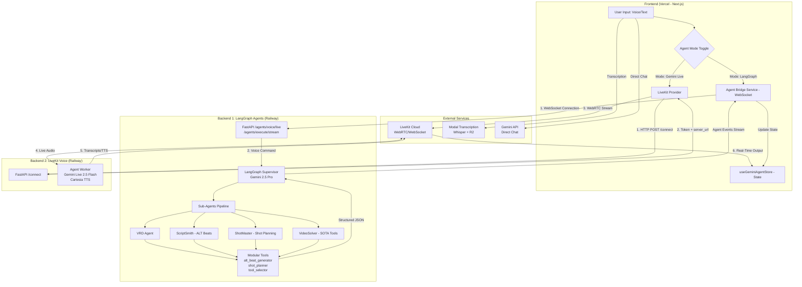

# Multi-Agent Video Production System - Architecture

## Overview

This is a properly architected multi-agent AI system following software engineering best practices with **separation of concerns**, **levels of abstraction**, and **modular design**.

Based on Perplexity research guidance and industry best practices.

---

## Complete System Architecture (3 Backends + Frontend)

The PokerCats video editor uses a **distributed, multi-service architecture** with three independent backend services:

| Component | Location | Framework | Purpose |
|-----------|----------|-----------|---------|
| **Frontend** | `apps/web/` | Next.js 15, React, Zustand | User interface, state management, orchestrates all backend connections |
| **Backend 1** (LangGraph Agents) | `apps/agents/` | FastAPI, LangGraph, LangChain, Pydantic | Complex video planning: VRD analysis, script generation (ALT beats), shot planning, SOTA tool selection |
| **Backend 2** (LiveKit Voice) | Separate repo: `anansitrading-chat-vrd-backend-livekit` | FastAPI, LiveKit Agents SDK | Real-time voice interaction: Low-latency STT, LLM inference (Gemini Live 2.5 Flash), TTS (Cartesia) |
| **Backend 3** (Transcription) | `apps/transcription/` | Python (Modal Serverless) | Non-real-time audio transcription (Whisper) |

### Deployment Infrastructure

- **Frontend:** Vercel (auto-deploys from `main` branch)
- **Backend 1 (LangGraph Agents):** Railway (https://mvp20-production.up.railway.app)
  - Environment variable: `NEXT_PUBLIC_AGENTS_API_URL`
  - Protocol: HTTP with Server-Sent Events (SSE)
- **Backend 2 (LiveKit Voice):** Railway (https://chat-vrd-backend-livekit-production.up.railway.app)
  - Environment variable: `NEXT_PUBLIC_LIVEKIT_BACKEND_URL`
  - Protocol: WebRTC via LiveKit Cloud
- **Backend 3 (Transcription):** Modal
  - Environment variable: `MODAL_TRANSCRIPTION_URL`
  - Protocol: HTTP POST

---

## Two Distinct Voice Interaction Paths

### Path 1: Real-Time Voice Chat (Backend 2 - LiveKit)

**Used for:** Simple conversational AI, immediate STT/TTS, low-latency chat

```
1. Frontend calls LiveKit backend: POST /connect
2. Backend provisions LiveKit room + agent worker
3. Backend returns {token, server_url}
4. Frontend connects to LiveKit Cloud via WebRTC
5. Real-time audio streaming: User ↔ LiveKit ↔ Gemini Live + Cartesia TTS
6. Transcripts stream back to frontend in real-time
```

**Key Files:**
- Frontend: `apps/web/src/components/livekit/LiveKitProvider.tsx`
- Backend: `anansitrading-chat-vrd-backend-livekit/agent.py`

---

### Path 2: Structured Video Generation (Backend 1 - LangGraph)

**Used for:** Complex multi-step workflows like "Create a 60s product demo video"

```
1. Frontend connects via HTTP SSE: NEXT_PUBLIC_AGENTS_API_URL
2. Frontend sends POST to /agents/execute/stream
3. LangGraph Supervisor interprets command
4. Supervisor delegates to sub-agents:
   - VRD Agent → Analyze requirements
   - ScriptSmith → Generate ALT beats script
   - ShotMaster → Plan camera shots
   - VideoSolver → Select optimal AI tools
5. Agent execution events stream back via Server-Sent Events (SSE)
6. Frontend updates UI with tool calls, status, results
```

**Key Files:**
- Frontend: `apps/web/src/services/agent-bridge-service-sse.ts`
- Backend: `apps/agents/agents/supervisor.py`, `apps/agents/routes/execute.py`

---

## Frontend Orchestration

### State Management (`useGeminiAgentStore`)

The frontend manages two distinct agent systems via Zustand:

```typescript
{
  agentSystem: 'gemini' | 'langgraph',  // Toggle between paths
  activeAgents: ['vrd', 'script_smith', ...],
  chatHistory: [...],
  geminiAssets: [...],
  connectionStatus: 'idle' | 'connecting' | 'connected'
}
```

### Agent Mode Selection (`RightPanel.tsx`)

Users can switch between:
1. **Gemini Live** (Backend 2): Quick voice chat, real-time interaction
2. **LangGraph Agents** (Backend 1): Structured video production workflows

---

## Backend 1 (LangGraph Agents) - Detailed Architecture

This section describes the **apps/agents/** service in detail.

---

## Directory Structure

```
apps/agents/
├── models/                    # Data models (Pydantic schemas)
│   ├── __init__.py
│   ├── alt_beat.py           # ALT beat structures
│   ├── shot.py               # Shot specifications
│   └── production_plan.py    # Production planning models
│
├── tools/                     # Reusable tool functions
│   ├── __init__.py
│   ├── alt_beat_generator.py # Generate ALT beats from VRD
│   ├── clarifying_questions.py # HITL question generation
│   ├── shot_planner.py       # Convert beats to shots
│   └── tool_selector.py      # SOTA tool selection
│
├── workflows/                 # Orchestration logic
│   ├── __init__.py
│   └── production_orchestrator.py # Multi-agent coordinator
│
├── agents/                    # Agent implementations (legacy)
│   ├── __init__.py
│   ├── sub_agents.py         # Original agents
│   └── supervisor.py         # LangGraph supervisor
│
├── routes/                    # API endpoints
│   ├── __init__.py
│   └── execute.py            # SSE streaming API
│
├── config/                    # Configuration files
│   └── settings.yaml
│
├── main.py                    # FastAPI app entry point
├── requirements.txt
└── README.md
```

---

## Architecture Principles

### 1. Separation of Concerns

Each component has a single, well-defined responsibility:

- **Models**: Data structures and type definitions
- **Tools**: Business logic for beat generation, shot planning, tool selection
- **Workflows**: Orchestration and agent coordination
- **Agents**: LangGraph agent wrappers (minimal, delegates to tools)
- **Routes**: HTTP API layer

### 2. Dependency Inversion

- High-level modules (workflows) depend on abstractions (models)
- Low-level modules (tools) implement the abstractions
- Tools don't know about agents; agents use tools

### 3. Modularity

Each file is focused and independently testable:

```python
# Good: Focused modules
from tools.alt_beat_generator import generate_alt_beats
from tools.shot_planner import generate_shot_list
from tools.tool_selector import generate_production_plan

# Bad: Everything in one file (old approach)
from sub_agents import *  # 800+ lines of mixed concerns
```

### 4. Type Safety

All data structures use Pydantic models:

```python
from models.alt_beat import Script, ALTBeat
from models.shot import ShotList, Shot
from models.production_plan import ProductionPlan

# Type-checked, validated, serializable
script: Script = generate_alt_beats(vrd, clarifications, mode)
```

---

## Component Responsibilities

### Models (`models/`)

**Purpose**: Define data structures with validation

**Files**:
- `alt_beat.py`: ALT beat schema with complete metadata
- `shot.py`: Shot specifications and shot list
- `production_plan.py`: Production plan with tool selection

**Key Types**:
- `ALTBeat`: Atomic narrative unit (5-10s) with complete metadata
- `Script`: Collection of beats with 8-part structure
- `Shot`: Camera specification with technical requirements
- `ShotList`: Collection of shots with asset summary
- `ProductionPlan`: Tool selection and cost/time estimates

### Tools (`tools/`)

**Purpose**: Implement core business logic

**Files**:
- `alt_beat_generator.py`: Generate ALT beats from VRD using 8-part structure
- `clarifying_questions.py`: Generate HITL questions based on VRD gaps
- `shot_planner.py`: Convert ALT beats to shot specifications
- `tool_selector.py`: Select optimal AI tools using SOTA research

**Key Functions**:
```python
# ALT beat generation
generate_alt_beats(vrd, clarifications, mode) -> Script
validate_alt_beats_timing(beats, target_duration) -> dict

# Clarifying questions (HITL)
ask_clarifying_questions(vrd, mode) -> list[dict]

# Shot planning
generate_shot_list(alt_beats, mode) -> ShotList

# Tool selection (SOTA)
generate_production_plan(shot_list, constraints, mode) -> ProductionPlan
select_optimal_tool_for_shot(shot, constraints) -> Workflow
```

### Workflows (`workflows/`)

**Purpose**: Orchestrate multi-agent pipelines

**Files**:
- `production_orchestrator.py`: Coordinate VRD → Script → Shots → Plan

**Key Classes**:
```python
class ProductionOrchestrator:
    """
    Manages the complete production pipeline
    Supports HITL and YOLO modes
    """
    
    def __init__(self, mode: Literal["hitl", "yolo"])
    def set_vrd(self, vrd: dict) -> dict
    def provide_clarifications(self, clarifications: dict) -> dict
    def generate_script() -> dict
    def generate_shots() -> dict
    def generate_plan(constraints: dict) -> dict
    def execute_full_pipeline(vrd: dict) -> dict
```

**Modes**:
- **HITL** (Human-in-the-Loop): Pause for user approval at each stage
- **YOLO** (Full Auto): Execute entire pipeline without interruption

---

## Data Flow

### HITL Mode (Step-by-step)

```
1. User provides VRD
   ↓
2. System asks clarifying questions
   ↓
3. User answers questions
   ↓
4. System generates Script with ALT beats
   ↓
5. User reviews/approves script
   ↓
6. System generates Shot List
   ↓
7. User reviews/approves shots
   ↓
8. System generates Production Plan
   ↓
9. User reviews/approves plan
   ↓
10. Execute production
```

### YOLO Mode (Full Auto)

```
1. User provides VRD
   ↓
2. System uses intelligent defaults
   ↓
3. Generates Script → Shots → Plan
   ↓
4. Returns complete production package
```

---

## Usage Examples

### Basic Usage (Python)

```python
from workflows import ProductionOrchestrator

# Initialize orchestrator
orchestrator = ProductionOrchestrator(mode="yolo")

# Define VRD
vrd = {
    'project_name': 'Product Demo Video',
    'video_type': 'product_demo',
    'estimated_duration': '60s',
    'target_audience': 'B2B decision makers',
    'tone': 'professional',
    'core_message': 'Our platform makes video creation 10x faster'
}

# Execute full pipeline
result = orchestrator.execute_full_pipeline(vrd)

print(f"Generated {result['summary']['beats']} beats")
print(f"Generated {result['summary']['shots']} shots")
print(f"Estimated cost: ${result['summary']['cost_usd']}")
print(f"Estimated time: {result['summary']['time_minutes']} minutes")
```

### HITL Mode (Interactive)

```python
from workflows import ProductionOrchestrator

orchestrator = ProductionOrchestrator(mode="hitl")

# Step 1: Set VRD
vrd_result = orchestrator.set_vrd(vrd)

if vrd_result['status'] == 'needs_clarification':
    # Step 2: Display questions to user
    questions = vrd_result['questions']
    user_answers = get_user_input(questions)  # Your UI logic
    
    # Step 3: Provide answers
    orchestrator.provide_clarifications(user_answers)

# Step 4: Generate script
script_result = orchestrator.generate_script()

# Review with user
if user_approves_script():
    # Step 5: Generate shots
    shots_result = orchestrator.generate_shots()
    
    # Review with user
    if user_approves_shots():
        # Step 6: Generate plan
        plan_result = orchestrator.generate_plan()
```

### Using Tools Directly

```python
from tools import generate_alt_beats, generate_shot_list, generate_production_plan

# Generate script
script = generate_alt_beats(vrd, clarifications={}, mode="yolo")

# Generate shots
shot_list = generate_shot_list(script.beats, mode="yolo")

# Generate plan
plan = generate_production_plan(
    shot_list,
    constraints={'quality_priority': 'high'},
    mode="yolo"
)

print(f"Total cost: ${plan.total_estimated_cost_usd}")
print(f"Primary tools: {plan.workflow_summary.primary_tools}")
```

---

## Testing

Each module is independently testable:

```python
# Test beat generation
def test_generate_alt_beats():
    vrd = {...}
    script = generate_alt_beats(vrd, mode="yolo")
    
    assert script.total_beat_count == 8
    assert all(b.duration_seconds > 0 for b in script.beats)
    assert script.metadata.duration_seconds == 60

# Test shot planning
def test_generate_shot_list():
    beats = [...]  # Mock beats
    shot_list = generate_shot_list(beats, mode="yolo")
    
    assert shot_list.total_shots > 0
    assert all(s.shot_type in SHOT_TYPE_MAP.values() for s in shot_list.shots)

# Test tool selection
def test_select_optimal_tool():
    shot = Shot(...)  # Mock shot
    workflow = select_optimal_tool_for_shot(shot)
    
    assert workflow.total_cost > 0
    assert workflow.quality_score > 8.0
```

---

## Configuration

### Mode Selection

```python
# HITL: User approvals required
orchestrator = ProductionOrchestrator(mode="hitl")

# YOLO: Full automation
orchestrator = ProductionOrchestrator(mode="yolo")
```

### Quality Constraints

```python
constraints = {
    'quality_priority': 'high',      # 'high', 'balanced', 'budget'
    'max_cost_per_shot': 1.0,        # USD
    'max_total_cost': 50.0,          # USD
    'max_time_minutes': 180          # Minutes
}

plan = generate_production_plan(shot_list, constraints, mode="yolo")
```

---

## Benefits of This Architecture

### 1. Maintainability
- Each file has single responsibility
- Easy to locate and fix bugs
- Clear dependency graph

### 2. Testability
- Tools can be unit tested independently
- Workflows can be integration tested
- Models provide type safety

### 3. Scalability
- Add new tools without touching existing code
- Extend models with backward compatibility
- Swap tool implementations easily

### 4. Readability
- Clear separation of concerns
- Type hints throughout
- Documented interfaces

### 5. Reusability
- Tools can be used directly or via agents
- Models shared across components
- Workflows composable

---

## Next Steps

1. ✅ Models defined with Pydantic
2. ✅ Tools implemented with business logic
3. ✅ Workflows for orchestration
4. → Integrate with existing LangGraph agents
5. → Add API endpoints for HTTP access
6. → Create test suite
7. → Add Deep Research Agent for tool discovery

---

## Key Differences from Old Architecture

| Aspect | Old (`sub_agents.py`) | New (Modular) |
|--------|----------------------|---------------|
| **File Count** | 1 file, 800+ lines | 12+ files, ~200 lines each |
| **Separation** | Mixed concerns | Clear boundaries |
| **Testing** | Hard to test | Easy unit tests |
| **Types** | Dict-based | Pydantic models |
| **Reusability** | Agent-coupled | Tool-focused |
| **Extensibility** | Modify monolith | Add new modules |

---

## Complete System Architecture Diagram



---

## Key Architectural Decisions

### 1. Separation of Real-Time vs. Structured Generation

**Why two separate backends?**
- **Backend 2 (LiveKit):** Optimized for low-latency voice (<100ms), uses Gemini Live 2.5 Flash
- **Backend 1 (LangGraph):** Optimized for complex reasoning, uses Gemini 2.5 Pro with multi-agent coordination

**Cost optimization:**
- Real-time chat: Uses Flash ($0.075/1M tokens - 97% cheaper)
- Complex planning: Uses Pro ($1.25/1M tokens - better reasoning)

### 2. Modular Tool Design (Backend 1)

**Why separate `tools/` from `agents/`?**
- Tools contain pure business logic (testable, reusable)
- Agents are thin wrappers that call tools via LangGraph
- Tools can be used directly without agent overhead
- Easy to add new tools without modifying agents

### 3. WebSocket for LangGraph, WebRTC for LiveKit

**Why different protocols?**
- **WebSocket (Backend 1):** Server-Sent Events (SSE) for agent status, tool calls, streaming results
- **WebRTC (Backend 2):** Peer-to-peer audio streaming with LiveKit Cloud, minimal latency

### 4. Model Factory Pattern

**Why dynamic model selection?**
- Different tasks require different models (reasoning vs. speed)
- Cost optimization: Use Flash for repetitive tasks (97% savings)
- Easy to add new providers (OpenAI, Anthropic) without changing agent code

---

## Observability & Production Features

### Graceful Degradation (Backend 1)

```python
# If enhanced agents fail to import, fallback to legacy
try:
    from .enhanced_sub_agents import create_enhanced_vrd_agent
    ENHANCED_AGENTS_AVAILABLE = True
except ImportError:
    from .sub_agents import create_vrd_agent  # Fallback
    ENHANCED_AGENTS_AVAILABLE = False
```

### Startup Validation

```python
# agents/startup_validation.py
- Checks all dependencies at launch
- Validates environment variables
- Provides actionable error messages
- Logs degradation reasons
```

### Structured Logging

```python
# agents/observability.py
- Agent mode tracking (optimal vs. degraded)
- Tool execution metrics
- LLM token usage
- Error attribution
```

---

**This is how professional multi-agent systems should be built.**
